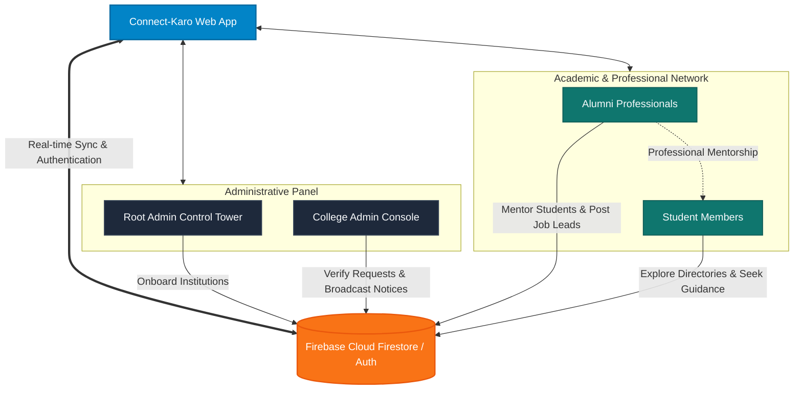

# 🌐 Connect-Karo

> A unified, role-based professional networking platform connecting Students, Alumni, and College Administrations.

[](https://react.dev)
[](https://vite.dev)
[](https://firebase.google.com)
[](https://tailwindcss.com)

---

## 🚀 Overview

**Connect-Karo** is a high-performance web portal built to bridge the gap between academic environments and professional industries. By integrating direct networking nodes, college verification queues, and system-wide notice broadcasts, the platform establishes a secured space for mentorship, institutional management, and alumni relations.



---

## ✨ Key Features

### 🛡️ Administrative Controls
* **Root Admin Tower**: System-wide dashboard to onboard universities, monitor commercial billing plans, manage customer support tickets, and post global network updates.
* **College Admin Console**: Review and approve student/alumni registration requests, manage institutional directories, update college-wide announcements, and adjust settings.

### 🎓 Interactive User Dashboards
* **Student Dashboard**: Request verification, view official institutional notices, browse verified alumni directories, and connect with mentors.
* **Alumni Directory**: Seamlessly share industry trends, current employer details, LinkedIn networking links, and mentor junior students.

---

## ⚡ Developer & Evaluator Portal Access

> [!TIP]
> **Mock Authorization is Enabled in Production:**
> If you are deploying or testing the live application (e.g. on **Vercel**), you don't need to register a new domain or create a Firebase user. Simply navigate to the **Sign In** screen and scroll down to access the **Developer & Evaluator Portal Access** panel. Clicking any role will immediately bypass the auth pipeline with mock profiles!

---

## ⚙️ Tech Stack

* **Frontend Framework**: [React 19](https://react.dev) + [Vite](https://vite.dev)
* **Styling & Aesthetics**: [Tailwind CSS](https://tailwindcss.com)
* **Backend Database & Auth**: [Firebase v12](https://firebase.google.com)
* **Icons**: [React Icons](https://react-icons.github.io/react-icons/) & [Lucide Icons](https://lucide.dev)

---

## 🛠️ Getting Started

### 1. Clone & Install Dependencies
```bash
git clone https://github.com/hrittik702/Connect-karo.git
cd Connect-karo
npm install
```

### 2. Configure Firebase Environment
Create a `.env.local` file in the root directory and add your Firebase credentials:
```env
VITE_FIREBASE_API_KEY=your_api_key
VITE_FIREBASE_AUTH_DOMAIN=your_auth_domain
VITE_FIREBASE_PROJECT_ID=your_project_id
VITE_FIREBASE_STORAGE_BUCKET=your_storage_bucket
VITE_FIREBASE_MESSAGING_SENDER_ID=your_messaging_sender_id
VITE_FIREBASE_APP_ID=your_app_id
```

### 3. Run Locally
```bash
npm run dev
```
